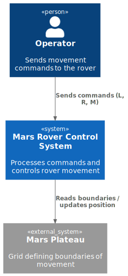

# 03. System Context

## Context Diagram



```
┌──────────┐   commands (L, R, M)    ┌──────────────────────────┐
│ Operator │ ──────────────────────▶ │  Mars Rover Control      │
│          │ ◀────────────────────── │  System                  │
└──────────┘   final positions       └────────────┬─────────────┘
                                                  │ validates positions
                                                  ▼
                                     ┌────────────────────────┐
                                     │  Mars Plateau          │
                                     │  (in-memory grid)      │
                                     └────────────────────────┘
```

## External Interfaces

### Operator → System (stdin)

| Aspect | Detail |
|--------|--------|
| Channel | Standard input |
| Format | Plain text — plateau dimensions on line 1, then pairs of (initial position line, command string line) per rover |
| Example input | `5 5` → `1 2 N` → `LMLMLMLMM` |

### System → Operator (stdout)

| Aspect | Detail |
|--------|--------|
| Channel | Standard output |
| Format | One line per rover: `x y HEADING` |
| Example output | `1 3 N` |

## What is NOT in scope

- No network communication
- No persistent storage
- No GUI
- No concurrent or real-time rover control
