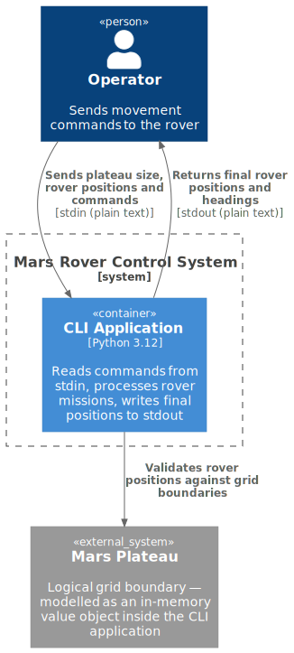
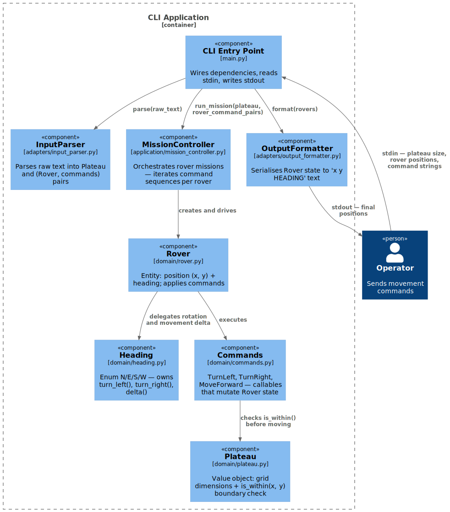

# 05. Building Block View

## Level 1 — System

The entire system is a single **CLI application** (one Python process). No external services or databases.



---

## Level 2 — Components



### Component Overview

| Component | Layer | Responsibility |
|-----------|-------|----------------|
| `__main__` | Adapter | Entry point — wires dependencies, reads stdin, writes stdout |
| `InputParser` | Adapter | Parses raw text into `Plateau` and `(Rover, [Command])` pairs |
| `OutputFormatter` | Adapter | Serialises `Rover` state to `x y HEADING` text |
| `MissionController` | Application | Orchestrates the mission — iterates rovers and their command sequences |
| `Plateau` | Domain | Value object holding grid dimensions; exposes `is_within(x, y)` |
| `Rover` | Domain | Entity holding `(x, y, heading)`; applies commands one at a time |
| `Heading` | Domain | Enum `N \| E \| S \| W`; owns rotation and movement-delta logic |
| `Command` | Domain | Protocol / callable — `TurnLeft`, `TurnRight`, `MoveForward` |

---

## Domain Model

```
Plateau
  - width: int
  - height: int
  + is_within(x: int, y: int) → bool

Rover
  - x: int
  - y: int
  - heading: Heading
  + execute(command: Command) → None

Heading (Enum)
  N | E | S | W
  + turn_left()  → Heading
  + turn_right() → Heading
  + delta()      → tuple[int, int]   # (dx, dy) for a forward move

Command (Protocol / callable)
  TurnLeft    → rover.heading = rover.heading.turn_left()
  TurnRight   → rover.heading = rover.heading.turn_right()
  MoveForward → new = rover.pos + rover.heading.delta()
                if plateau.is_within(new): rover.pos = new
```

---

## Package Structure

```
mars_rover/
├── __main__.py                  # CLI entry point
├── adapters/
│   ├── input_parser.py          # InputParser
│   └── output_formatter.py      # OutputFormatter
├── application/
│   └── mission_controller.py    # MissionController
└── domain/
    ├── plateau.py               # Plateau
    ├── rover.py                 # Rover
    ├── heading.py               # Heading enum
    └── commands.py              # TurnLeft, TurnRight, MoveForward
```
