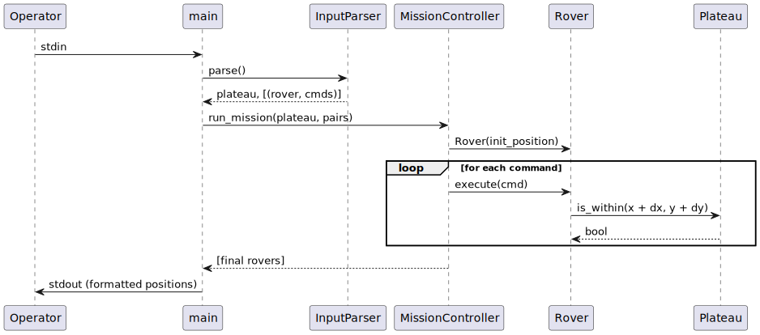
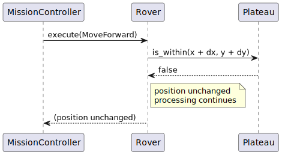
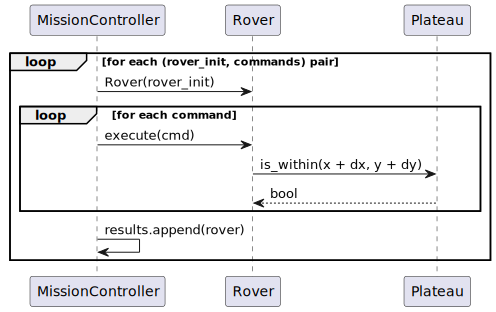

# 06. Runtime View

## Scenario 1 — Happy Path (single rover)

---

## Scenario 2 — Boundary Violation

When `MoveForward` computes `(x + dx, y + dy)` and `Plateau.is_within()` returns `False`:

1. The rover's position is **not updated** — it stays in place.
2. Processing continues with the next command in the sequence.
3. No exception is raised; the mission completes normally.

---

## Scenario 3 — Multiple Rovers

Each rover is fully independent. The final state of rover N has no effect on rover N+1.

---

## Scenario 4 — Obstacle Detected (optional extension)

If obstacles are registered on the plateau:

1. `MoveForward` calls `Plateau.is_blocked(x + dx, y + dy)`.
2. If blocked, the rover stops and the mission for that rover ends early.
3. Output includes the last safe position prefixed with `O:` (or similar convention).
